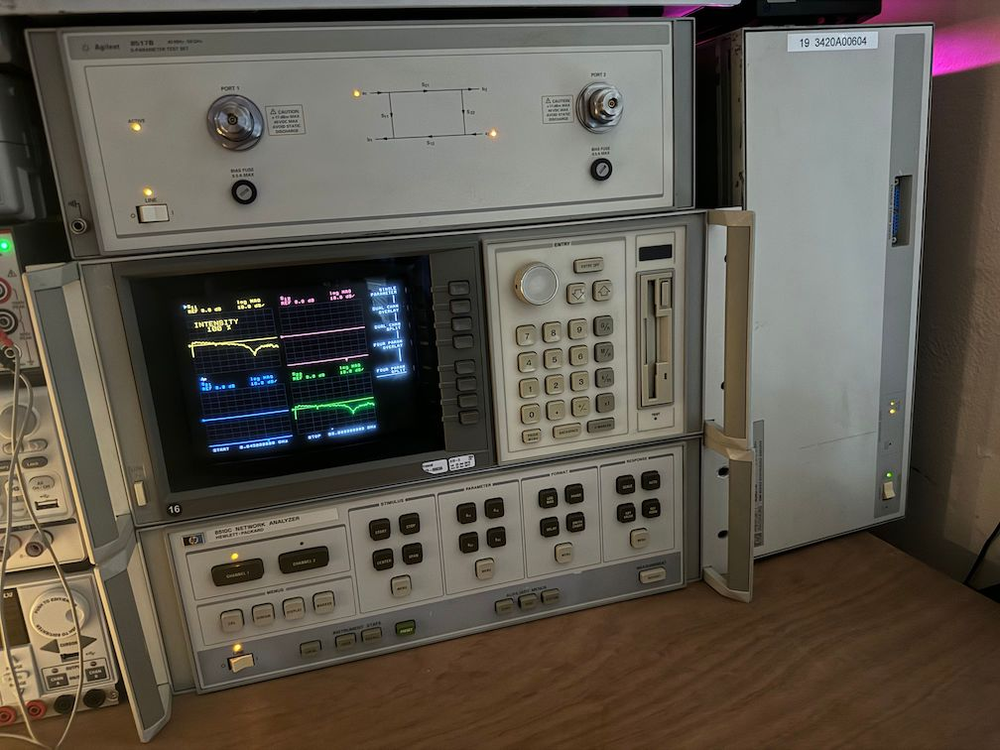
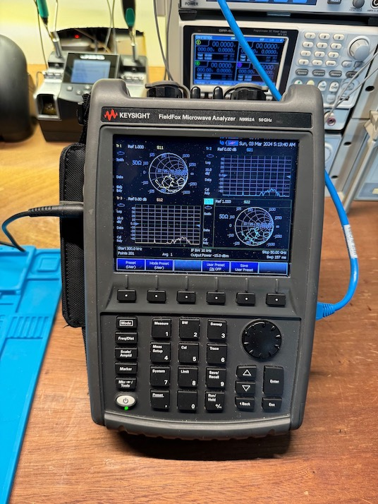
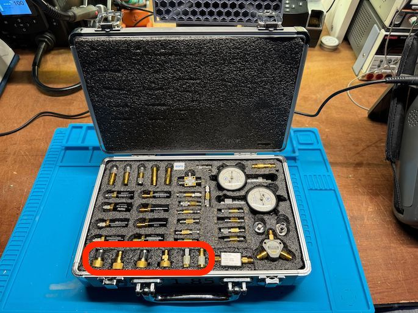
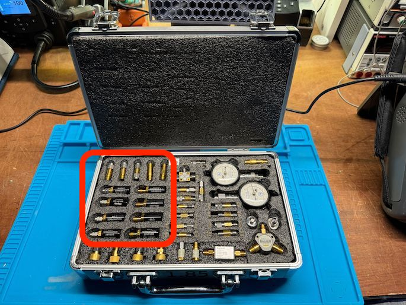
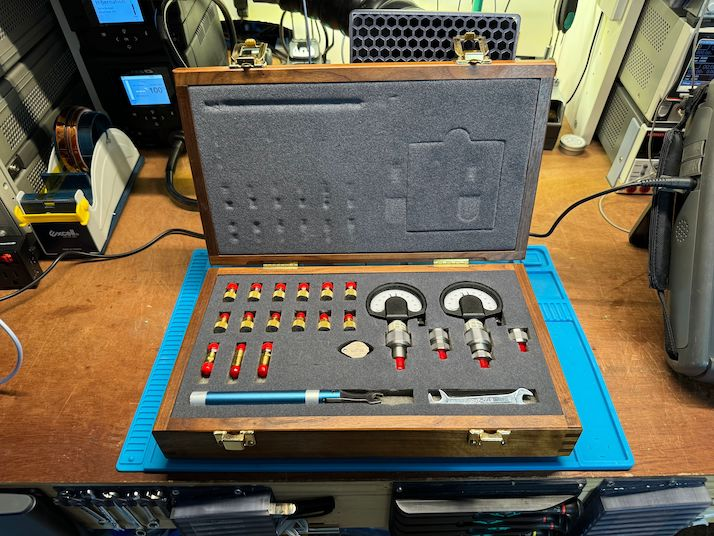

# Calibration!

<h1 style="text-align:center">Meet the Vector Network Analyzers</h1>
<table>
<tr>
<td style="text-align: center; vertical-align: middle;">
 
8510C (45MHz-50GHz)
</td>
<td style="text-align: center; vertical-align: middle;">
 
FieldFox (300kHz-50GHz)
</td>
</tr>
</table>

<h1 style="text-align:center">Meet the Calibration Kits</h1>
<table>
<tr>
<td style="text-align: center; vertical-align: middle;">
 
Keysight 85056D (2.4mm)
</td>
<td style="text-align: center; vertical-align: middle;">
 
Anritsu 3654B (1.85mm)
</td>
<td style="text-align: center; vertical-align: middle;">
 
Keysight 85058B (1.85mm)
</td>
</tr>
</table>

# Experiments

1. **DIRECT:** Female calibration standards are directly attached to the male VNA ports.
2. **SEA_3654B:** Swap Equal Adapters with the Anritsu 1.85mm adapters.
3. **SEA_85058B:** Swap Equal Adapters with the Keysight 1.85mm adapters.
4. **DRIFT_8510C:** A 2.4mm female short was attached directly to the 8510C port 1 and repeated measurements were taken over 15+ hours.
4. **DRIFT_FieldFox:** A 2.4mm female short was attached directly to the FieldFox port 1 and repeated measurements were taken over 15+ hours.

The Swap Equal Adapters methodology compares calibration standards of different genders by assuming that the adapter swap does not impact the measurement. If a set of adapters is designed with this in mind, it generally works fairly well, and the top-shelf cal kits generally come with a set of these adapters. Alternatively, known standards of different gender can be used to de-embed the adapters.

# Environment

This project uses `pipenv.` Install the environment using `pipenv install` inside this directory, and use `pipenv shell` to obtain a shell with the environment active.

# Notebooks

* **obtain_drift.ipynb:** Device control notebook for DRIFT_8510C and DRIFT_FieldFox.
* **obtain_measurements.ipynb:** Device control notebook for the DIRECT and SEA_* experiments.
* **quick_check.ipynb:** Plot some of the standards against each other.